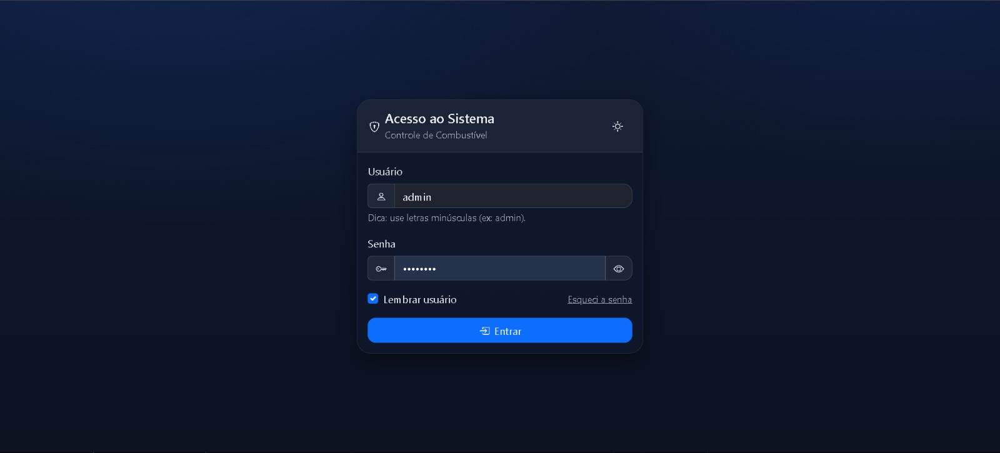
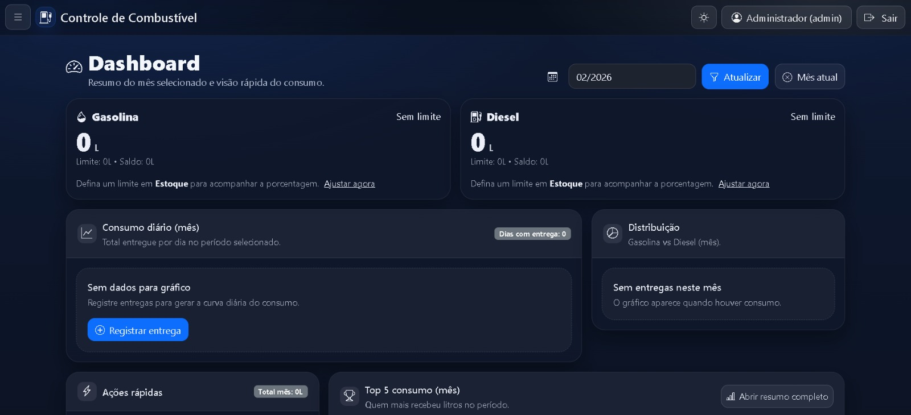
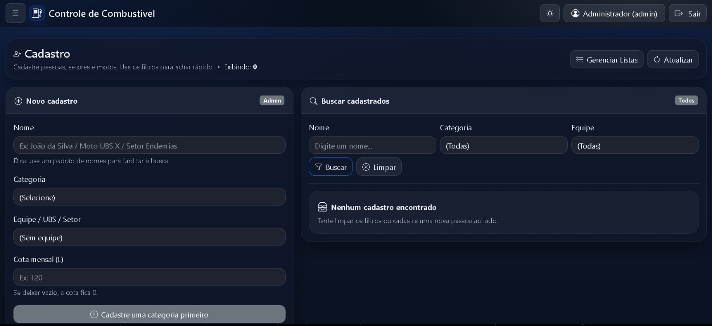
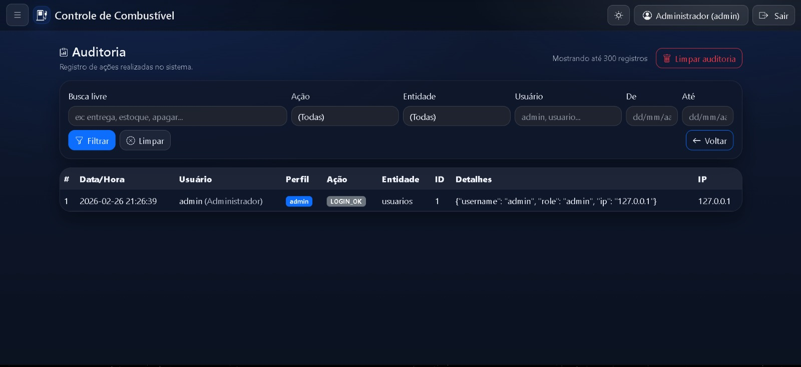
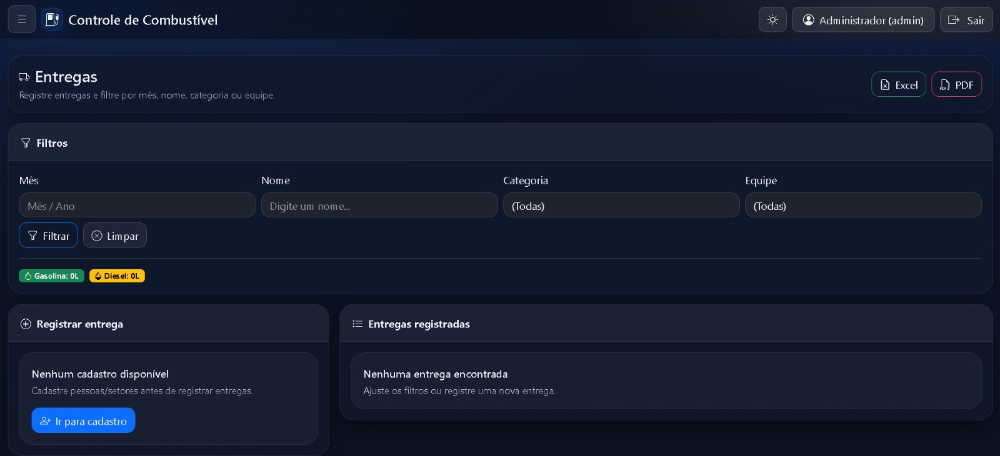

# 🚗 Sistema de Gerenciamento de Combustível

Aplicação web desenvolvida em **Python com Flask**, projetada para controle completo de estoque de combustível, com foco em **segurança, rastreabilidade, integridade de dados e controle de acesso baseado em funções**.

O sistema foi estruturado seguindo boas práticas de desenvolvimento backend, modelagem relacional e segregação de responsabilidades, podendo ser utilizado em ambientes institucionais ou governamentais.

---

## 🎯 Objetivo do Projeto

Garantir:

- Controle preciso de entradas e saídas de combustível  
- Auditoria completa das ações realizadas no sistema  
- Gestão de usuários com níveis de permissão  
- Geração de relatórios para prestação de contas  
- Integridade e consistência dos dados  

---

## 🏗 Arquitetura e Tecnologias Utilizadas

- **Python** – Lógica de negócio  
- **Flask** – Framework web backend  
- **SQLite** – Banco de dados relacional (atualmente)  
- **PostgreSQL** – Compatível para futura migração em produção  
- **Bootstrap** – Interface responsiva  
- **Jinja2** – Renderização dinâmica de templates  
- **OpenPyXL / ReportLab** – Exportação de relatórios em Excel e PDF  

---

## 🔐 Segurança e Controle de Acesso

### 🔑 RBAC — Role-Based Access Control

- Perfis distintos: **Administrador** e **Usuário**
- Restrições de acesso a rotas sensíveis
- Proteção contra execução indevida de operações críticas

### 🔒 Autenticação

- Sistema de login e logout com controle de sessão
- Validação de credenciais
- Senhas armazenadas com hash seguro
- Controle de tempo de sessão

---

## 📦 Gestão de Estoque

- Registro de entradas de combustível  
- Registro de entregas/saídas  
- Atualização automática do saldo  
- Validação para impedir saldo negativo  
- Modelagem relacional estruturada  
- Histórico mensal de movimentações  

---

## 📝 Auditoria e Rastreabilidade

Sistema completo de auditoria com:

- Registro do usuário responsável  
- Data e horário da ação  
- Tipo de operação realizada  
- Histórico permanente para controle administrativo  

Esse módulo garante **transparência e accountability**, fundamentais em ambientes públicos ou corporativos.

---

## 📊 Relatórios e Exportações

- 📄 Geração de relatórios em **PDF**  
- 📊 Exportação estruturada em **Excel**  
- Filtros por período  
- Dados organizados para prestação de contas e análise gerencial  

---

## 📸 Interface do Sistema

### 🔐 Tela de Login

### 📊 Dashboard

### 📁 Cadastros

### 📝 Auditoria

### 🚛 Entregas

---

## 🧠 Diferenciais Técnicos

- Estrutura preparada para escalar para PostgreSQL  
- Separação clara entre regras de negócio e interface  
- Código organizado para manutenção futura  
- Foco em segurança e controle de acesso  
- Aplicação pronta para deploy em rede interna  

---

## 🚀 Possíveis Evoluções Futuras

- Dashboard com indicadores visuais (gráficos)  
- Controle de estoque mínimo com alertas  
- Backup automático do banco  
- API REST para integração com outros sistemas  
- Logs avançados para auditoria de segurança 
